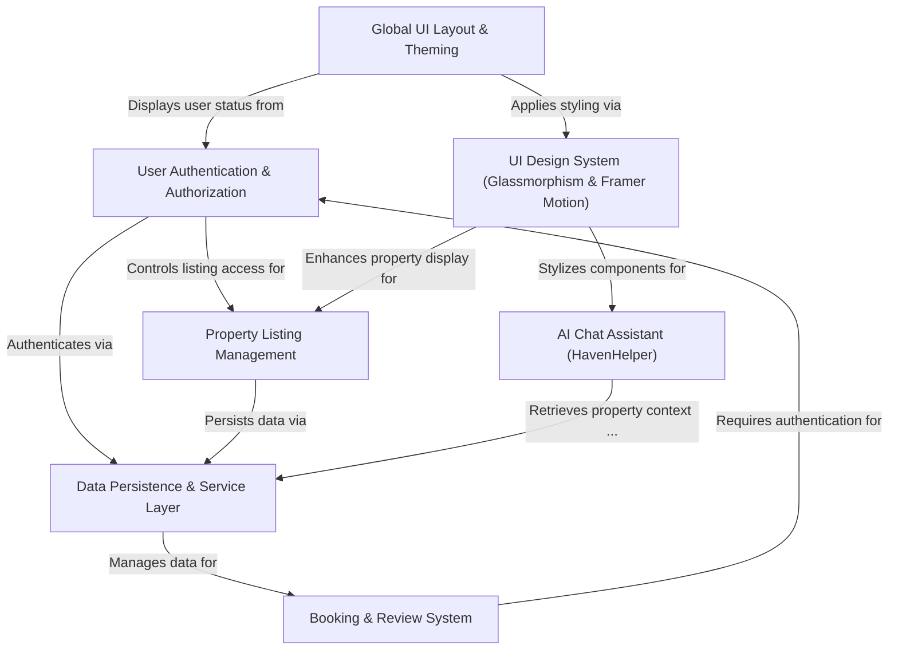

# Tutorial: HomeStead-Haven

HomeStead Haven is an **avant-garde real estate platform** for India, blending an *immersive 3D-inspired user interface* with a **smart AI chat assistant** for personalized property search. It provides a complete experience for **listing, booking, and reviewing luxury homes**, all secured by **robust user authentication** and supported by a flexible data system.

## Visual Overview

## Chapters

1. [UI Design System (Glassmorphism & Framer Motion)
](01_ui_design_system__glassmorphism___framer_motion__.md)
2. [Global UI Layout & Theming
](02_global_ui_layout___theming_.md)
3. [User Authentication & Authorization
](03_user_authentication___authorization_.md)
4. [Property Listing Management
](04_property_listing_management_.md)
5. [AI Chat Assistant (HavenHelper)
](05_ai_chat_assistant__havenhelper__.md)
6. [Booking & Review System
](06_booking___review_system_.md)
7. [Data Persistence & Service Layer
](07_data_persistence___service_layer_.md)

---
